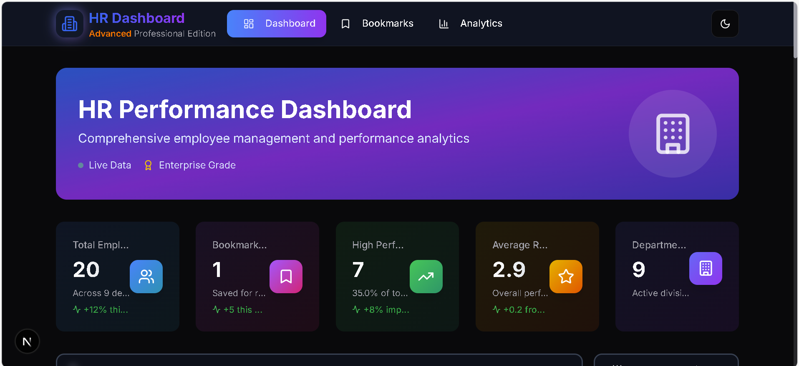
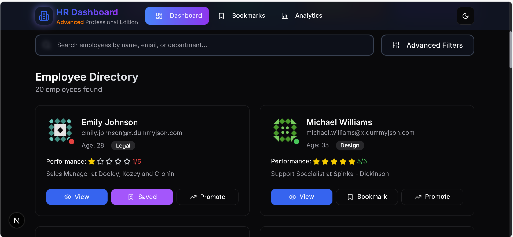

# 🏢 HR Performance Dashboard (Advanced)

A comprehensive, enterprise-grade HR management system built with modern web technologies. This dashboard enables HR managers to track employee performance, manage bookmarks, and gain valuable insights through advanced analytics.


## 🔧 Tech Stack

- **Framework**: Next.js 15 (App Router)
- **Language**: TypeScript
- **Styling**: Tailwind CSS + Custom CSS Variables
- **State Management**: Zustand with Persistence
- **UI Components**: shadcn/ui + Custom Components
- **Charts**: Recharts
- **Icons**: Lucide React
- **Data Fetching**: Native Fetch API
- **Theme**: Next-themes (Dark/Light Mode)


## preview pic



## 🚀 Features Implemented

### ✅ Core Features (All Implemented)

#### 🏠 Dashboard Homepage (/)
- ✅ Fetches data from `https://dummyjson.com/users?limit=20`
- ✅ Enhanced user cards with:
  - Full Name, Email, Age, Department
  - 5-star performance rating system
  - Color-coded department badges
  - Professional gradient designs
- ✅ Fully functional buttons:
  - **View**: Navigate to detailed employee profile
  - **Bookmark**: Toggle bookmark status with toast notifications
  - **Promote**: Async promotion action with loading states

#### 🔍 Search & Filter
- ✅ Real-time search by name, email, or department (case-insensitive)
- ✅ Advanced multi-select filter dropdown:
  - Filter by department (10 departments)
  - Filter by performance rating (1-5 stars)
- ✅ Active filter badges with remove functionality
- ✅ Clear all filters option

#### 👤 Dynamic User Details Page (/employee/[id])
- ✅ Comprehensive employee profile with:
  - Personal information (address, phone, email)
  - Performance metrics with color-coded ratings
  - Company information and role details
- ✅ Tabbed interface with dynamic content:
  - **Overview**: Company info and address
  - **Projects**: Current active projects with progress
  - **Feedback**: Performance reviews with ratings and comments
- ✅ Bookmark and promote functionality on detail page

#### 📌 Bookmark Manager (/bookmarks)
- ✅ Complete bookmark management system:
  - List all bookmarked employees
  - Bulk selection with checkboxes
  - Remove individual or multiple bookmarks
  - Bulk actions (Promote multiple employees)
- ✅ Empty state handling with helpful messaging

#### 📊 Analytics Page (/analytics)
- ✅ Comprehensive analytics dashboard with:
  - **Department Performance**: Bar chart showing average ratings
  - **Rating Distribution**: Pie chart with percentage breakdown
  - **Performance Trends**: Area chart showing monthly progress
  - **Employee Satisfaction**: Line chart with satisfaction metrics
- ✅ Interactive charts with tooltips and animations
- ✅ Department performance overview table
- ✅ Key metrics cards with trend indicators

### ⚙️ Technical Requirements (All Met)

- ✅ **Next.js App Router**: Full implementation with proper routing
- ✅ **Client-side data fetching**: Real-time updates and interactions
- ✅ **Custom hooks**: 
  - `useStore` (Zustand-based state management)
  - `useToast` (Notification system)
  - `useMobile` (Responsive design helper)
- ✅ **Reusable components**:
  - Card, Badge, Button, Input components
  - EmployeeCard, SearchFilters, Navigation
  - StatCard, Charts components
- ✅ **Responsive design**: Mobile-first approach (320px to 4K)
- ✅ **Dark/Light mode**: Complete theme system with persistence

### 🧠 Advanced Features (All Implemented)

- ✅ **State Management**: Zustand with localStorage persistence
- ✅ **Loading & Error States**: Component-level loading skeletons and error handling
- ✅ **Modular Architecture**: Clean folder structure with separation of concerns
- ✅ **Form Handling**: Search, filters, and feedback forms
- ✅ **Accessibility**: Keyboard navigation, ARIA labels, semantic HTML
- ✅ **Performance**: Optimized images, lazy loading, efficient re-renders

### ⭐️ Bonus Features (Implemented)

- ✅ **Advanced Animations**: Hover effects, transitions, and micro-interactions
- ✅ **Professional Design**: Enterprise-grade UI with gradients and shadows
- ✅ **Toast Notifications**: Real-time feedback for user actions
- ✅ **Responsive Navigation**: Mobile hamburger menu with slide-out panel
- ✅ **Data Persistence**: Bookmarks saved across browser sessions
- ✅ **Mock Data Enhancement**: Rich employee profiles with projects and feedback

## 📁 Project Structure

```text
hr-dashboard/
├── app/
│   ├── analytics/
│   │   └── page.tsx          # Analytics dashboard
│   ├── bookmarks/
│   │   └── page.tsx          # Bookmark management
│   ├── employee/
│   │   └── [id]/
│   │       └── page.tsx      # Employee detail page
│   ├── globals.css           # Global styles and CSS variables
│   ├── layout.tsx            # Root layout with navigation
│   ├── loading.tsx           # Loading component
│   └── page.tsx              # Dashboard homepage
├── components/
│   ├── ui/                   # shadcn/ui components
│   ├── employee-card.tsx     # Employee card component
│   ├── navigation.tsx        # Navigation with mobile menu
│   ├── search-filters.tsx    # Search and filter components
│   ├── mode-toggle.tsx       # Dark/light mode toggle
│   └── theme-provider.tsx    # Theme context provider
├── lib/
│   ├── api.ts                # Data fetching and API calls
│   └── store.ts              # Zustand state management
├── hooks/
│   └── use-toast.ts          # Toast notification hook
└── tailwind.config.ts        # Tailwind configuration
```


## 🚀 Getting Started

### Prerequisites
- Node.js 18+ 
- npm, yarn, or pnpm

### Installation
Sure! Here's the **correct and clean version** of your setup instructions for proper Markdown preview — ideal for a `README.md` file or documentation:

---

### 🚀 Project Setup Instructions

---

1. **Clone the repository**

```bash
git clone https://github.com/Balaji91221/hr-dashboard
cd hr-dashboard
```

2. **Install dependencies**

```bash
npm install
# or
yarn install
# or
pnpm install
```

3. **Run the development server**

```bash
npm run dev
# or
yarn dev
# or
pnpm dev
```

4. **Open your browser**
   Visit: [http://localhost:3000](http://localhost:3000)

---

### 📦 Build for Production

```bash
npm run build
npm start
```


## 🎯 Key Features Showcase

### 🏠 Dashboard
- **Real-time Search**: Instant filtering across 20+ employees
- **Advanced Filters**: Multi-select department and rating filters
- **Interactive Cards**: Hover effects and smooth animations
- **Responsive Grid**: Adapts from 1 to 4 columns based on screen size

### 📊 Analytics
- **Department Performance**: Visual comparison of team ratings
- **Rating Distribution**: Clear breakdown of performance levels
- **Trend Analysis**: Monthly performance tracking
- **Interactive Charts**: Hover tooltips and smooth animations

### 👤 Employee Profiles
- **Comprehensive Details**: Full employee information
- **Tabbed Interface**: Organized information display
- **Performance Metrics**: Visual rating system
- **Action Buttons**: Bookmark and promote functionality

### 📱 Mobile Experience
- **Responsive Design**: Optimized for all screen sizes
- **Touch-Friendly**: Large buttons and touch targets
- **Mobile Navigation**: Slide-out menu with smooth animations
- **Adaptive Layout**: Content reflows for optimal mobile viewing

## 🎨 Design System

### Color Palette
- **Primary**: Blue to Purple gradients
- **Success**: Green to Emerald gradients  
- **Warning**: Yellow to Orange gradients
- **Error**: Red to Pink gradients
- **Neutral**: Gray scale with proper contrast

### Typography
- **Headings**: Inter font with gradient text effects
- **Body**: Clean, readable typography with proper line heights
- **Interactive**: Hover states and focus indicators

### Components
- **Cards**: Professional shadows and hover effects
- **Buttons**: Gradient backgrounds with smooth transitions
- **Badges**: Color-coded department indicators
- **Charts**: Interactive with custom tooltips

## 🔧 Configuration

### Environment Variables
No environment variables required - the app uses public APIs and localStorage.

### Customization
- **Colors**: Modify `tailwind.config.ts` for custom color schemes
- **Departments**: Update department list in `components/search-filters.tsx`
- **API**: Change data source in `lib/api.ts`


## 🤝 Contributing

1. Fork the repository
2. Create a feature branch (`git checkout -b feature/amazing-feature`)
3. Commit your changes (`git commit -m 'Add amazing feature'`)
4. Push to the branch (`git push origin feature/amazing-feature`)
5. Open a Pull Request

## 📄 License

This project is licensed under the MIT License - see the [LICENSE](LICENSE) file for details.

## 🙏 Acknowledgments

- **shadcn/ui** for the excellent component library
- **Recharts** for beautiful, responsive charts
- **DummyJSON** for providing test data
- **Lucide** for the comprehensive icon set
- **Vercel** for seamless deployment platform

---

**Built with ❤️ using Next.js, TypeScript, and Tailwind CSS**

